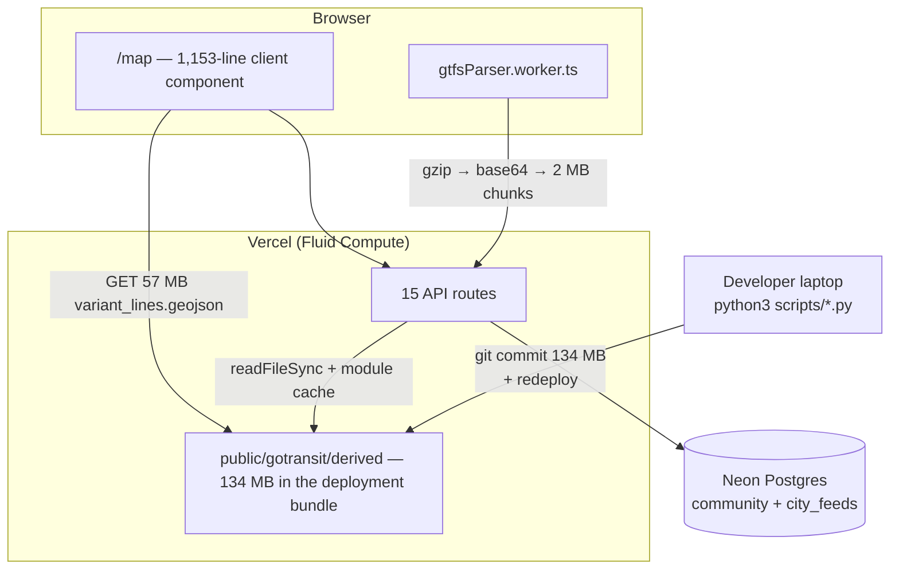
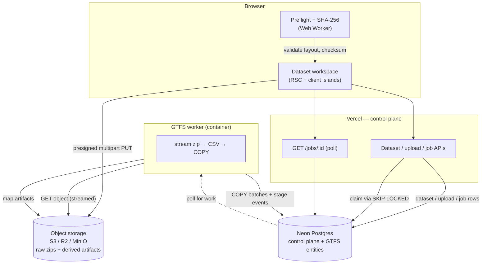
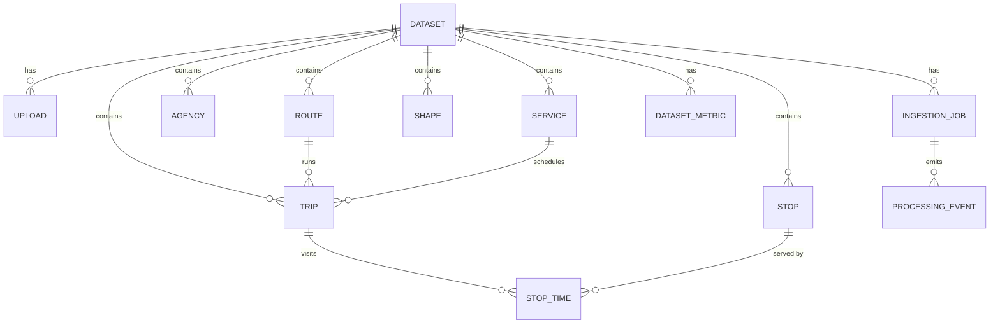

# TransitFlow — Architecture Assessment

*Phase 1 of the platform redesign. Written against `main` @ `58b7bf8`.*

This document is the audit that the redesign is built on: what exists today, what
is actually broken, what the target architecture is, and how we get from one to
the other without breaking the running product.

---

## 1. Current architecture

### 1.1 Repository shape

```
transit-flow/
├── client/                      Next.js 16 App Router — the entire product
│   ├── app/                     8 pages, 15 API routes
│   ├── components/              ~40 components (7 UI primitives)
│   ├── lib/                     GTFS helpers, Drizzle schema, auth, simulation
│   ├── hooks/                   5 data hooks
│   └── public/gotransit/derived 134 MB of committed JSON  ← data plane in git
├── server/data/gotransit/       208 MB of committed raw GTFS  ← data plane in git
├── scripts/                     4 Python scripts (the real GTFS pipeline)
├── worker/                      node_modules only (orphaned from an unmerged branch)
└── docs/                        (new)
```

The root `package.json` holds only husky + commitlint. There is no workspace
tooling; `client/` is the app and everything else is loose supporting material.

### 1.2 Runtime architecture as deployed



Every piece of transit data is precomputed on a laptop, committed to git, and
read off the serverless filesystem with `readFileSync`. Postgres holds only
community content and user-uploaded overlay blobs. There are no GTFS entity
tables anywhere.

### 1.3 GTFS ingestion as it exists today

There are **two** unrelated ingestion paths, neither of which is a pipeline.

**Path A — the official GO feed (manual, laptop-only).**
Unzip a Metrolinx feed into `server/data/gotransit/`, run three Python scripts,
commit ~134 MB of generated JSON, push, redeploy. There is no job, no status, no
validation, no history, and no rollback. The 208 MB source feed is committed too.

**Path B — user-uploaded city overlays (`city_feeds`, browser-only).**
`AddCityFeedModal` → `gtfsParser.worker.ts` streams the zip in a Web Worker with
`fflate`, collapses trips into unique stop-sequence *patterns*, discards per-row
data, gzips the reduced payload, and chunk-uploads it as base64 into
`city_feed_chunks.data` (a Postgres `TEXT` column).

The worker itself is genuinely good work — real streaming zip, a chunk-spanning
quote-aware CSV parser, bounded memory. But the architecture around it caps out
hard:

| Limit | Value | Set by |
| --- | --- | --- |
| Request body | ~4.5 MB | Vercel platform |
| Upload chunk | 2 MB | `UPLOAD_CHUNK_BYTES` |
| Max chunks | 16 | `MAX_CHUNKS` |
| Max payload | 24 MB gzipped | `MAX_PAYLOAD_BYTES` |
| Feeds per user | 6 | `MAX_FEEDS_PER_USER` |

The raw archive **never leaves the user's machine**. The server stores a lossy
derivative in base64 (≈33% size inflation) inside the primary OLTP database. The
original feed cannot be re-derived, re-validated, or re-processed, because it was
never uploaded.

### 1.4 Data model

`lib/db/schema.ts` — six tables, all community/overlay:

`community_users`, `community_posts`, `community_likes`, `community_comments`,
`city_feeds`, `city_feed_chunks`.

No `Dataset`, no `Route`, no `Stop`, no `Trip`, no `StopTime`, no `Shape`, no job
or version table. No migrations directory beyond one hand-written additive SQL
file, applied manually through the Neon SQL editor because `DATABASE_URL` is a
Vercel *Sensitive* variable that `vercel env pull` returns empty.

### 1.5 API surface

15 routes. The transit ones (`/api/routes`, `/api/stops`, `/api/schedule`,
`/api/departures`, `/api/simulation`, `/api/variant-*`, `/api/rail/route`) all
follow the same shape: `readFileSync` a JSON file from `public/`, `JSON.parse`
it, cache the parsed object in a module-level variable, filter in JavaScript,
return everything. No pagination, no cursors, no database-level filtering.
`/api/simulation` hard-caps output at 2,000 trips and 300 shape points because
there is no other way to bound the response.

### 1.6 Frontend architecture

| File | Lines |
| --- | --- |
| `components/panels/ScheduleModal.tsx` | 2,323 |
| `components/panels/BuilderWizard.tsx` | 1,847 |
| `components/panels/ExtendRouteWizard.tsx` | 1,378 |
| `app/map/page.tsx` | 1,153 |
| `components/Map.tsx` | 1,016 |
| **Five files** | **7,717** |

`/map` is one `"use client"` component holding all four product modes (Explore,
Design, Schedules, Simulate), Mapbox layer wiring, URL-param routing, and
cross-component coordination via custom DOM events and `localStorage`.

### 1.7 Design system

Tailwind v4 + shadcn tokens, plus a parallel `--landing-*` token set for
marketing, plus ~150 lines of hand-written component CSS in `globals.css`
(`.vhp-*` popup, `.sim-hud-slider`, marquee keyframes).

Primitives present: `badge`, `button`, `dialog`, `input`, `label`, `sheet`,
`tabs` — seven.

Primitives absent: table, dropdown/menu, progress, skeleton, status indicator,
empty state, error state, toast surface, card, tooltip, breadcrumb, pagination.
Everything data-shaped is hand-rolled per screen.

### 1.8 Auth, deployment, environment

- **Auth**: next-auth v5 JWT, GitHub + Google. `session.user.id` is the provider
  id; `upsertUser` syncs into `community_users` before any write.
- **Authorization**: one gate, hardcoded in a page file —
  `app/dashboard/page.tsx:27` compares against the literal string `"faizm10"`
  and an email address. There is no role model.
- **Deployment**: Vercel, single project, `client/` as root. CI runs
  typecheck + build + one Playwright spec.
- **Environment**: root `.env` already contains `S3_*`, `REDIS_URL`,
  `BLOB_WEBHOOK_PUBLIC_KEY`, `GTFS_JOB_ATTEMPTS` — provisioned for the unmerged
  pipeline branch (§1.9). `client/.env.development.local` is a symlink to it.

### 1.9 Prior art: `feat/gtfs-ingestion-pipeline` (unmerged, ~7,000 lines)

This branch is the single most valuable asset in the repository and it is not on
`main`. It contains a working, well-reasoned ingestion pipeline:

- `gtfs_versions` + `gtfs_ingestion_jobs` tables, with a **partial unique index**
  enforcing one active version per source
- S3-compatible storage with presigned PUT (MinIO locally, R2/S3 in prod)
- BullMQ + Redis queue; Dockerised Node worker that shells out to the existing
  Python scripts
- A genuinely clever **browser preflight**: reads only the zip's central
  directory to validate layout before uploading, plus a chunked SHA-256 that
  streams 8 MB at a time so a 500 MB zip never becomes a 500 MB `ArrayBuffer`
- Owner-only admin UI, architecture docs, CI job, `docker-compose.yml`

Its limits, relative to what we now need: it is **admin-only**, hardwired to a
single `source = "go-transit"`, produces **JSON artifacts rather than database
rows**, and the public app still reads the git-committed files — activation
updates Postgres and nothing else.

**We build on this branch rather than starting over.**

---

## 2. Major problems

Ranked by severity.

### P1 — The browser downloads 57 MB of GeoJSON on every map load

`components/Map.tsx:554` registers `/gotransit/derived/variant_lines.geojson`
(57 MB) as a Mapbox source, plus `rail_display.geojson` (5.8 MB) at line 617.
This is not a subtle regression; it is the dominant cost of the product's main
screen, on every visit, uncached-first-load, including mobile.

### P2 — The data plane lives in git and in the deployment bundle

134 MB of derived JSON and 208 MB of raw GTFS are **tracked in git**. `.git` is
832 MB. Every deploy ships the 134 MB. Every clone pays for all of it. A feed
refresh is a git commit.

### P3 — Serverless functions `JSON.parse` 57–59 MB files

`/api/simulation` parses the 57 MB GeoJSON; `lib/server/rail-routing.ts` reads
the 59 MB `rail_network.json`. Both cache into module memory. On Fluid Compute
this is survivable only because instances are reused — a cold instance pays the
full parse, and the resident set is enormous for what the endpoint returns.

### P4 — There is no ingestion pipeline, only two dead ends

Official feeds are refreshed by hand on a laptop. User feeds are parsed in the
browser and stored lossily. Neither can ingest a multi-gigabyte archive, neither
has a job, a stage, a retry, a resumable upload, or a server-side validation
step. The raw user archive is never uploaded, so nothing can ever be re-derived.

### P5 — GTFS entities are not in the database

There is no table for routes, stops, trips, stop_times, or shapes. Every query
the product wants to support — stop lookup, spatial search, trip filtering,
service-date filtering, analytics — has to be answered by pre-baking a JSON file
on a laptop. This is the root cause of P1, P2, and P3, and it is the reason the
product cannot add a screen without adding a build script.

### P6 — Binary blobs in base64 in the OLTP database

`city_feed_chunks.data` is a `TEXT` column holding base64 gzip. Object storage
exists in the environment already; this is the wrong home for it.

### P7 — 7,700 lines in five frontend files

No separation between page orchestration, map layer management, and product
modes. `ScheduleModal` at 2,323 lines is a single component. This is the main
maintainability tax and it makes the UX redesign impossible to do incrementally
without first splitting these.

### P8 — No design system

Seven primitives, no table/progress/skeleton/empty-state, and one-off CSS in
`globals.css`. Every new screen currently means new bespoke markup.

### P9 — Authorization is a hardcoded string in a page component

`OWNER_GITHUB = "faizm10"` in `app/dashboard/page.tsx`. Adding a second surface
that needs the same gate means copying the constant.

### P10 — `.env` with live secrets is not gitignored

The root `.gitignore` covers `.vercel`, `.gstack/`, `node_modules/`,
`__pycache__/`, `*.pyc` — **not `.env`**. The file currently holds a live
`DATABASE_URL`, `AUTH_SECRET`, and OAuth client secrets, and shows up as
untracked in `git status`. One `git add -A` commits production credentials.
*(Fixed as the first commit on this branch.)*

### P11 — There is no product concept of "a dataset"

The app is hardwired to one GO Transit feed. City feeds are a toggle inside the
map. There is no workspace, no dataset lifecycle, no place to see what was
imported, when, whether it succeeded, or what it contains. The entire UX the
redesign calls for has no data model to hang from.

---

## 3. Proposed architecture

### 3.1 Target system



Three planes, cleanly separated:

- **Control plane** (Neon Postgres): datasets, uploads, jobs, stage events,
  metrics. Small rows, frequently read.
- **Data plane** (object storage): raw archives and derived map artifacts. Large,
  immutable, never in git.
- **Query plane** (Neon Postgres): normalized GTFS entities, written by `COPY`,
  read with real indexes and cursor pagination.

### 3.2 Key decisions

| Decision | Choice | Why | Rejected alternative |
| --- | --- | --- | --- |
| **Upload transport** | S3-compatible **presigned multipart** | Only option giving true resumable upload with per-part retry and cancellation. Identical API for MinIO locally and R2 in prod. Bypasses Vercel's 4.5 MB body cap entirely. | Vercel Blob client upload — simpler, but the container worker is outside Vercel, and multipart part-level retry is what Part 4 actually requires. |
| **Queue** | **Postgres `FOR UPDATE SKIP LOCKED`** | Neon already exists. Zero new infrastructure, zero new bill, one fewer thing to operate. Job state and queue state stay in one transaction — no split-brain between Redis and Postgres. | BullMQ + Redis (already scaffolded on the prior branch). Kept behind a `Queue` interface so it can be swapped in if throughput ever demands it — it does not today at concurrency 1. |
| **Parsing** | **Streaming** zip entry → streaming CSV → batched `COPY` | Bounded memory regardless of feed size. `stop_times.txt` is 166 MB for one agency and will be larger. | `INSERT` batches (10–50× slower); full extraction to disk (unbounded). |
| **Progress transport** | **Polling** (2 s), stage rows in Postgres | Survives reload, tab close, and serverless instance recycling with no extra machinery. State is reconstructed from the backend, which Part 12 requires anyway. | SSE holds a Fluid function open for the whole job — real Active-CPU cost for no benefit over a 2 s poll. WebSockets need a server we do not have. |
| **GTFS entities** | Normalized tables in Neon, `dataset_id`-scoped | Enables stop/route/trip lookup, spatial queries, service-date filtering, and analytics as *queries* instead of prebaked files. Kills P1–P3 and P5 at the root. | Keep prebaking JSON (status quo); DuckDB/Parquet (a second query engine to operate). |
| **Map geometry** | Derived artifacts in object storage, served by key + vector tiles for large layers | Removes the 57 MB browser download without giving up map fidelity. | Continue shipping GeoJSON from `public/`. |
| **Worker runtime** | Single Docker container, concurrency 1, horizontally scalable later | Boring and portable — Railway, Render, Fly, Cloud Run, ECS all run it unchanged. | Kubernetes; Vercel functions (cannot run for minutes on multi-GB input). |

Explicitly **not** introducing: Kafka, Kubernetes, Redis, microservices, Spark,
a tracing collector. The boundaries above allow each of them later; none is
justified by current scale.

### 3.3 Data model



- **`dataset`** — the user-facing object: name, owner, status, active version.
- **`upload`** — one archive: key, byte size, checksum, multipart state, so an
  interrupted upload is resumable rather than restarted.
- **`ingestion_job`** — one processing attempt: stage, last completed stage,
  progress, attempt count, error, timestamps. Retryable without re-upload.
- **`processing_event`** — the append-only stage log that drives the processing
  UI and gives us observability for free.
- **GTFS entities** — `dataset_id`-scoped, indexed for the workloads Part 8
  names: route lookup, stop lookup (incl. spatial), trip filtering, stop-time
  range scans, service-date filtering.
- **`dataset_metric`** — precomputed analytics so the overview page is one query.

`city_feeds` / `city_feed_chunks` are **not dropped**. They keep working through
the transition and are migrated into `dataset` afterwards.

### 3.4 Job lifecycle

`CREATED → UPLOADING → UPLOADED → QUEUED → VALIDATING → EXTRACTING → PARSING →
IMPORTING → INDEXING → ANALYZING → READY`, with `FAILED` reachable from any
stage and carrying `last_completed_stage` so a retry resumes rather than restarts.

Uploading and processing are separate stages with separate progress semantics:
upload progress is real bytes-sent (determinate); parse progress is real
bytes-of-archive-consumed (determinate); indexing and analysis are
**indeterminate** and will be shown as such rather than given a fake percentage.

---

## 4. Migration strategy

The rule for every phase: `main` keeps working. Nothing is deleted until its
replacement serves the same screen.

| Phase | Scope | Risk |
| --- | --- | --- |
| **1** | Audit (this document); gitignore `.env`; extract the owner gate | — |
| **2** | Design system + app shell. New primitives, token pass, `(workspace)` route group. No behaviour change. | Low |
| **3** | Dataset workspace UX against the **existing** GO data, so the IA is proven before the pipeline lands | Low |
| **4** | Upload architecture: presigned multipart, resumable, checksum, cancel/retry; preflight ported from the prior branch | Medium |
| **5** | Job model: `dataset`/`upload`/`ingestion_job`/`processing_event`, Postgres queue, polling API | Medium |
| **6** | Worker pipeline: streaming zip → CSV → `COPY`, bounded memory, staging tables, batch boundaries | **High** |
| **7** | Processing UI wired to real stages | Low |
| **8** | Exploration redesign reading from Postgres with cursor pagination + virtualization | Medium |
| **9** | Performance: kill the 57 MB GeoJSON download, drop the data plane out of git, split the 7.7k-line files | Medium |
| **10** | Docs, observability, cleanup | Low |

Each phase ends with `npm run lint`, `npm run build`, and the Playwright spec
green, in its own logically scoped commit.

### Sequencing note

Phase 9's git-history cleanup (removing 342 MB of tracked data) is the one step
that rewrites history and cannot be done quietly — it is called out separately
and left for explicit approval rather than folded into a commit.

---

## 5. Open decisions for the owner

Three questions genuinely change the work and are not mine to answer:

1. **Where does the worker run?** Railway / Render / Fly / Cloud Run all run the
   same container. This affects nothing in the code, but it does affect whether
   Phase 6 ends in something deployed or something deployable.
2. **How much GTFS goes into Neon?** One GO feed is ~5 M `stop_times` rows.
   That is fine on a paid Neon plan and not fine on the free tier. The fallback
   is to normalize routes/stops/trips/services into Postgres and keep
   `stop_times` in columnar files in object storage — slower for ad-hoc queries,
   far cheaper. Recommendation: full normalization, with dataset archival
   (drop entity rows, keep artifacts) as the retention valve.
3. **Is `/map` in scope for the redesign, or preserved as-is?** It is 7,700 lines
   across five files and is the existing product. Recommendation: preserve its
   behaviour, re-house it as the dataset's Map surface, and split the files in
   Phase 9 rather than rewriting the simulator.
