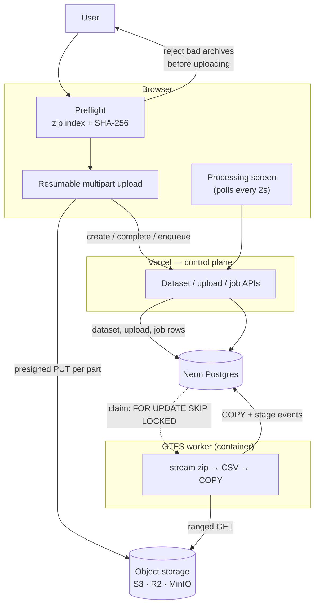
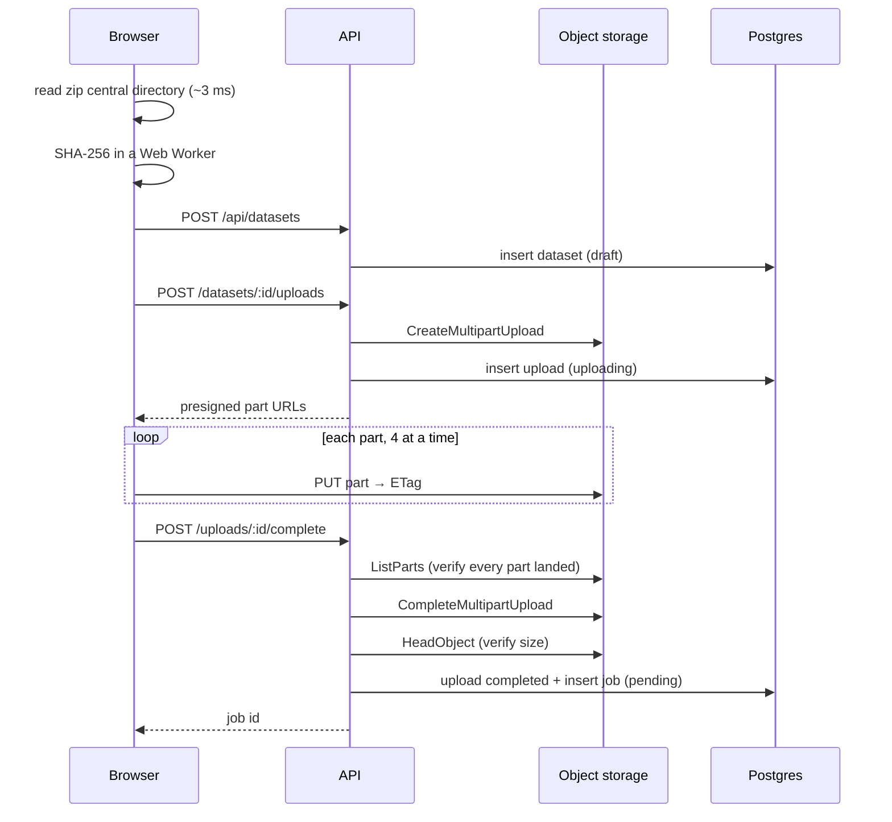

# GTFS ingestion

How a GTFS archive gets from a file picker into queryable tables, and what
happens when that goes wrong.

---

## 1. The shape of it



Three planes, and keeping them separate is most of the design:

| Plane | Lives in | Holds |
| --- | --- | --- |
| **Control** | Neon Postgres | datasets, uploads, jobs, stage events, issues, metrics |
| **Data** | Object storage | raw archives, derived artifacts |
| **Query** | Neon Postgres | normalized GTFS entities |

The archive never passes through a Next.js route handler. That is what makes
Vercel's ~4.5 MB body limit and function timeout irrelevant rather than
something to work around.

---

## 2. Upload lifecycle



### Why each piece exists

**Preflight before upload.** The worker is the authority on whether a feed is
valid, but it only speaks after the upload finishes. Reading the zip's central
directory costs a few hundred KB and about 3 ms on the real GO feed, and it
turns "upload 36 MB, wait, then learn `stops.txt` is missing" into an immediate
answer. Archives preflight cannot read degrade to a warning and upload anyway.

**Multipart, not a single PUT.** Per-part retry is the point: on a 2 GB upload
over a flaky connection, a single PUT means one dropped connection costs the
whole transfer. Parts are 16 MB by default, scaled up when a feed would
otherwise exceed S3's 10,000-part limit.

**Resume asks the server.** `GET /uploads/:id` returns the parts *the store
actually holds*, not what the browser thinks it sent — a crash is precisely the
event that invalidates the client's belief.

**Presigned URLs are re-signed mid-flight.** They expire in an hour, and a slow
multi-gigabyte transfer outlives that. `PATCH /uploads/:id` issues fresh ones
without restarting.

**Complete and enqueue are one request.** An upload that finished but was never
queued is an invisible failure: the archive is stored, billed, and nothing will
ever read it.

**Object keys are server-generated.** A client filename never reaches a key.
That eliminates path traversal outright and stops two users' `gtfs.zip`
colliding. The filename is kept for display only.

---

## 3. Processing lifecycle

Stages run in **dependency order**, not archive order:

```
validating → extracting → parsing → importing → indexing → analyzing → ready
```

| Stage | What happens |
| --- | --- |
| `validating` | Read the central directory. Resolve the feed root, check required files, reject unsafe paths and ambiguous archives. |
| `extracting` | One streaming pass to verify SHA-256 against what the browser computed. |
| `parsing` | agency, stops, routes, calendar — the small files. |
| `importing` | shapes, trips, stop_times — the ones that dominate the clock. |
| `indexing` | `ANALYZE`. The indexes already exist; what the planner lacks after a bulk load is statistics. |
| `analyzing` | Metrics, feed info, and validation issues. |

Routes and services must exist before trips can be checked against them, and
trips before stop_times. Reading the zip front-to-back would force us to take
files in whatever order the producer wrote them; random access removes the
problem, which is why the worker uses ranged reads rather than a sequential
stream.

### Bounded memory

This is the property the whole design exists to preserve, and it took two
attempts to actually get.

The naive version streams the archive and holds nothing. In practice three
things quietly scale with feed size:

1. **Inflate output chunks.** fflate's `Inflate` emits the entire output of one
   `push` as a single chunk. A 4 MB compressed read of CSV produced a **28.8 MB**
   chunk on the real GO feed — so the real bound was read size × compression
   ratio, and the ratio limit is 200×. Fixed by re-chunking output into 256 KB
   *copies* (`slice`, not `subarray`: a view keeps the oversized parent alive).

2. **Sliced strings.** V8 represents `bigString.slice(a, b)` as a pointer into
   the parent, so a 20-character GTFS id retained in a `Set` keeps its whole
   source chunk alive. Measured at ~85 MB for 400k ids that should cost ~16 MB.
   Fixed by flattening at the point of retention only — flattening all 55M field
   values would cost far more than it saves.

3. **Per-row dedupe.** `(dataset_id, trip_id, stop_sequence)` is a primary key,
   so duplicates must be dropped before COPY or the batch aborts. A `Set` of
   every row's key costs hundreds of megabytes at 5M rows. Fixed with a windowed
   dedupe: sequences for the current trip only, plus a set of closed trips, with
   a fallback for interleaved files that warns rather than silently weakening.

Measured on the real GO feed — a 36 MB archive whose `stop_times.txt` is
174 MB uncompressed, giving 3,161,342 stop times, 186,901 trips, 887 stops,
87 routes and 496 shapes:

| | Before the fixes | After |
| --- | --- | --- |
| Import time | 51 s | 58 s |
| Peak RSS, two consecutive imports in one process | 1.58 GB | 445 MB |
| Steady RSS during one import | 1.0 GB and climbing with row count | ~320 MB, flat |

The 7-second cost is the re-chunking copies, and it buys a memory profile that
no longer grows with the size of the feed. Before, RSS tracked rows imported —
360 MB at 1.1M rows, 1.0 GB at 3.2M — which is the signature of a leak, not of
a stream.

### Why COPY

`INSERT` batches are 10–50× slower at this scale. 3.16M `stop_times` rows at
INSERT speeds is tens of minutes of database time per import, holding a
connection the whole while. Text-format COPY rather than binary: binary is
marginally faster but requires every type's wire encoding to be exactly right,
and a mistake there is a corrupt row rather than a loud error.

---

## 4. The queue

`ingestion_jobs` **is** the queue. There is no Redis.

```sql
WITH claimable AS (
  SELECT id FROM ingestion_jobs
   WHERE status = 'pending' AND run_after <= now()
   ORDER BY run_after
     FOR UPDATE SKIP LOCKED
   LIMIT 1
)
UPDATE ingestion_jobs j
   SET status = 'running', claimed_by = $1, claimed_at = now(), ...
  FROM claimable WHERE j.id = claimable.id
RETURNING j.*
```

- `SKIP LOCKED` steps over rows another worker is claiming rather than blocking,
  so adding workers adds throughput instead of contention.
- The claim and the status change are **one write**. A worker cannot crash
  between "the queue says it's taken" and "the database says it's running",
  because there is only one of those.
- It is a single statement, which is its own transaction — so the same SQL runs
  from a Vercel function (where `neon-http` has no interactive transactions) and
  from the worker.
- A **partial unique index** allows at most one `pending`/`running` job per
  dataset. Two racing enqueues cannot both win; Postgres refuses the second.

Swapping in BullMQ later means reimplementing five functions and nothing else.

### Liveness

A running worker heartbeats every 20 s. A job whose heartbeat is older than
120 s was orphaned by a crash and any worker may reclaim it — one statement,
replacing BullMQ's stalled-job checker. The worst case of an ungraceful stop is
therefore a repeated import, never a lost one.

---

## 5. Failure handling

| Failure | Result |
| --- | --- |
| Not a zip, missing files, ambiguous root, unsafe paths | Non-retryable. Job fails immediately with a message naming the problem. |
| Checksum or size mismatch | Non-retryable — a corrupted upload cannot be fixed by trying again. |
| Decompression bomb (ratio or total size) | Non-retryable, caught against *actual* inflated bytes. |
| Database blip, network error, unexpected exception | Retryable. Exponential backoff from 15 s, up to `GTFS_JOB_ATTEMPTS` (default 3). |
| Worker killed mid-job | Heartbeat goes stale; another worker reclaims after 120 s. |
| Retries exhausted | Dataset marked `failed` — **unless it was already `ready`**. A failed re-import must not take away working data. |
| User clicks Retry | Job re-queued with the attempt counter reset. The archive is still in storage, so this costs a click rather than another upload. |

Every attempt begins by deleting the dataset's entity rows. That is indexed and
cheap, and it makes attempts idempotent without reasoning about which stage the
last one died in — verified by an integration test that runs the same job twice
and asserts the row count does not double.

### Errors users can act on

A failure carries a stable `code`, a sentence a person reads, and a `detail`
object with the specifics. Validation findings are separate: `dataset_issues`
holds **one row per issue code** with a count and a few samples, not one row per
occurrence. A feed with 400,000 dangling stop references produces one actionable
row, not 400,000.

So instead of "Something went wrong":

> `trips.txt` references route_ids that do not exist in `routes.txt`. Those trips
> will not appear under any route. — trips.txt · 17 occurrences · e.g. R-99, R-104

---

## 6. Progress reporting

Polling, every 2 seconds, from `GET /api/datasets/:id/jobs/:jobId`.

SSE would hold a Fluid function open for the entire job — minutes of billed wall
clock to deliver what a 2-second poll delivers anyway. WebSockets need a server
we do not run. Polling also survives a reload, a closed tab and an instance
recycle with no reconnection logic, which the processing screen needs regardless:
state has to be reconstructible from the backend.

**Progress is never fabricated.** It is stored in real units — bytes consumed,
rows written — with a nullable total. A percentage is shown only when the total
is genuinely known. `indexing` and `analyzing` cannot measure themselves and get
an indeterminate bar, because a number that crawls to 90% and stops teaches
users that the number means nothing.

Uploading and processing are separate stages with separate progress. Merging
them into one bar would misrepresent both: they measure different work at wildly
different speeds.

---

## 7. Security

GTFS archives are untrusted input.

| Risk | Control |
| --- | --- |
| Path traversal | `..` and absolute paths rejected in preflight *and* the worker. Object keys never derive from a filename. |
| Decompression bomb | Total uncompressed size and per-member ratio checked against real inflated bytes, not the archive's declared sizes — which a crafted archive can lie about. |
| Enormous archive | 8 GB ceiling, enforced before a key is issued. |
| Entry-count blowup | 10,000 entries; a real feed has a few dozen. |
| Malformed CSV | Bad rows become validation issues, not exceptions. |
| Ownership | Every dataset route resolves through `requireOwnedDataset`. A non-owner gets 404, not 403 — a 403 confirms the id exists. |
| Storage exposure | The bucket is private. Browsers only ever see short-lived presigned URLs for their own uploads. |
| Content type | Archives are stored as `application/octet-stream`, so the store can never serve one as HTML. |

Logs carry counts, durations, file names and error codes — never GTFS ids, stop
names or coordinates, which are the user's data.

---

## 8. Query performance

Measured against the real GO feed loaded into Postgres — 87 routes, 887 stops,
186,901 trips, 3,161,342 stop times:

| Query | Plan | Time |
| --- | --- | --- |
| Routes page (50 rows + trip counts) | index scan + index-only scan per row | **9.3 ms** |
| Stops page (50 rows + route counts) | index scan | **0.04 ms** |
| Stop search, `ILIKE '%union%'` | scan of 887 stops | **0.5 ms** |

The stops page is the one that had to be redesigned. Counting distinct routes
per stop as a correlated subquery made Postgres sequentially scan all 186,901
trips **once per stop** — 3.9 s for a single page. Batching the counts for the
page's 51 stop ids brought it to 382 ms, still with a seq scan.

The same aggregate over the *whole* feed takes 211 ms, because it scans
`stop_times` once. So it moved into the worker's `analyzing` stage and onto a
`gtfs_stops.route_count` column (`drizzle/0002_stop_route_count.sql`), costing
~3.4 s once per import and turning the page query into a pure index scan.

That is the general shape: anything that would join `stop_times` on a page
render belongs in `analyzing` instead.

**Known scaling limit.** Stop search is a leading-wildcard `ILIKE`, which cannot
use the name btree. It scans the dataset's stops — under a millisecond at 887,
and fine into the tens of thousands. A feed with hundreds of thousands of stops
would want a `pg_trgm` GIN index. Adding the extension before anything needs it
would be speculation.

---

## 9. Scaling

What exists today handles a 36 MB / 3.16M-row feed in under a minute at ~320 MB
of memory, on one worker at concurrency 1.

The boundaries that let it grow without a redesign:

- **More workers.** `SKIP LOCKED` already supports it; the per-dataset unique
  index already prevents two jobs racing on one feed. Run more containers.
- **Bigger feeds.** Memory is bounded by chunk size, not feed size, so the limit
  is import *time*, not capacity.
- **Bigger tables.** `gtfs_stop_times` is the first table that would want
  partitioning by `dataset_id`. Every index already leads with `dataset_id`, so
  that is a migration rather than a rewrite.
- **Real geometry.** A `(dataset_id, lat, lon)` btree serves bbox and radius
  queries today. PostGIS earns its place when the product needs buffers,
  intersections or network distance — not before.
- **A different queue.** Five functions behind one module.

Deliberately absent, and to stay absent until something forces them: Kafka,
Kubernetes, Redis, Spark, a tracing collector, autoscaling.

---

## 10. Local development

```bash
# 1. One env file at the repo root; client/.env.development.local symlinks to it.
cp .env.example .env
$EDITOR .env          # DATABASE_URL is the only value you must supply

# 2. Object storage + worker
docker compose up minio minio-init worker

# 3. The app
cd client && npm run dev
```

Postgres is deliberately **not** in compose: the app uses Neon, and pointing
local development at a different database than production is how schema drift
starts. Use a Neon branch.

`S3_ENDPOINT` and `S3_PUBLIC_ENDPOINT` must differ under compose — the worker
reaches MinIO as `http://minio:9000`, which a browser cannot resolve, while
presigned URLs handed to the browser must be signed for `http://127.0.0.1:9000`.
In production they are usually the same value.

MinIO console: <http://127.0.0.1:9001>

### Tests

```bash
cd client && npm run test:node          # preflight: zip index, layout, SHA-256
cd worker && npm run test:integration   # full pipeline against a real Postgres
```

The integration test creates and drops its own database, and substitutes a local
file for object storage through the `openSource` seam on `runIngestion` —
`ByteRangeSource` is the only thing the pipeline knows about storage, and S3
range reads and file reads satisfy the same contract.

To run it against the real GO feed:

```bash
cd server/data/gotransit && zip -r /tmp/go_feed.zip *.txt
cd worker && GTFS_INTEGRATION_ARCHIVE=/tmp/go_feed.zip npm run test:integration
```

---

## 11. Environment

| Variable | Used by | Notes |
| --- | --- | --- |
| `DATABASE_URL` | app, worker | Neon. The app uses the HTTP driver, the worker a TCP pool for COPY. |
| `S3_BUCKET` `S3_REGION` `S3_ACCESS_KEY_ID` `S3_SECRET_ACCESS_KEY` | app, worker | |
| `S3_ENDPOINT` | app, worker | Reachable from the server. |
| `S3_PUBLIC_ENDPOINT` | app | Reachable from the browser. Defaults to `S3_ENDPOINT`. |
| `S3_FORCE_PATH_STYLE` | app, worker | `true` for MinIO; unset for R2 and S3. |
| `GTFS_JOB_ATTEMPTS` | app | Retry budget. Default 3. |
| `WORKER_ID` | worker | Defaults to hostname + pid. |
| `WORKER_POLL_INTERVAL_MS` | worker | Default 2000. |
| `WORKER_COPY_BATCH_ROWS` | worker | Default 20,000. |
| `OWNER_GITHUB_LOGINS` `OWNER_EMAILS` | app | Privileged-surface allowlist. |

### Bucket CORS

Browsers upload parts directly, and the multipart upload cannot be completed
without reading each part's ETag — so the bucket must expose that header:

```json
[{
  "AllowedOrigins": ["https://your-app.vercel.app", "http://localhost:3000"],
  "AllowedMethods": ["PUT", "GET", "HEAD"],
  "AllowedHeaders": ["*"],
  "ExposeHeaders": ["ETag"],
  "MaxAgeSeconds": 3000
}]
```

Omitting `ExposeHeaders: ["ETag"]` is the single most common way to break this
pipeline; the uploader reports it explicitly rather than failing opaquely.
