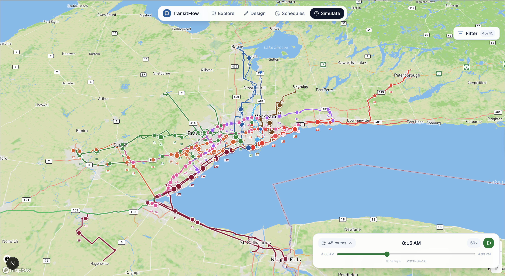

<div align="center">



# TransitFlow

**A browser-based workspace for exploring GO Transit, designing custom routes, and running live simulations — no software to install.**

[](https://transit-flow-two.vercel.app)
[](https://github.com/faizm10/transit-flow/actions)
[](https://nextjs.org)
[](LICENSE)

</div>

---

<!-- GA_STATS_START -->
## 📊 Live stats

| Metric | Last 7 days | Last 30 days | Last year |
|--------|:-----------:|:------------:|:---------:|
| Active users | **7** | **14** | **363** |
| Page views | **28** | **66** | **4,380** |
| Sessions | — | **21** | **554** |

<sub>🤖 Auto-updated every hour &nbsp;·&nbsp; Tue, 18 Aug 2026 19:18:46 GMT</sub>
<!-- GA_STATS_END -->

---

## What it does

| Mode | Description |
|------|-------------|
| **Explore** | Browse all 44 GO Transit train and bus routes on a live interactive map powered by real GTFS data |
| **Design** | Create a custom bus or train route — draw stops, set frequency or fixed departure times, and save |
| **Schedules** | Inspect departure times for every GO line, or view and edit your own route's timetable |
| **Simulate** | Run a time-of-day simulation and watch nearly 900 trips move across the GTHA in real time |
| **Community** | Share your network designs publicly and load routes created by other users |

---

## Getting started

### Prerequisites

- Node.js 20+
- A [Mapbox](https://mapbox.com) public token (free tier is enough)

### Run locally

```bash
git clone https://github.com/faizm10/transit-flow.git
cd transit-flow/client
npm install
```

Create `client/.env.local`:

```env
NEXT_PUBLIC_MAPBOX_ACCESS_TOKEN=your_token_here
MAPBOX_ACCESS_TOKEN=your_token_here
```

```bash
npm run dev
```

Open [http://localhost:3000](http://localhost:3000).

---

## Tech stack

- **Framework** — Next.js 16 (App Router, React 19)
- **Map** — Mapbox GL JS
- **Database** — Neon (PostgreSQL) + Drizzle ORM
- **Auth** — Auth.js (GitHub + Google OAuth)
- **Styling** — Tailwind CSS v4 + shadcn/ui
- **Video** — Remotion

---

## GTFS data pipeline

Raw feeds live under `server/data/gotransit/`. Derived assets are written to `client/public/gotransit/derived/`.

```bash
# From repo root
python3 scripts/build_subroutes.py \
  --input_dir server/data/gotransit \
  --output_dir client/public/gotransit/derived

python3 scripts/build_gtfs_derived.py

# Simulation artifacts
python3 scripts/build_simulation_artifacts.py \
  --input_dir server/data/gotransit \
  --output_dir client/public/gotransit/derived/simulation \
  --source gotransit
```

Or from `client/`: `npm run gtfs:derive`

---

## Deployment

Hosted on [Vercel](https://vercel.com) with the project root set to `client/`. CI runs on every push via [GitHub Actions](.github/workflows/client-ci.yml).

Required environment variables on Vercel:

```
NEXT_PUBLIC_MAPBOX_ACCESS_TOKEN
MAPBOX_ACCESS_TOKEN
NEXT_PUBLIC_SITE_URL
AUTH_SECRET
AUTH_GITHUB_ID / AUTH_GITHUB_SECRET
AUTH_GOOGLE_ID / AUTH_GOOGLE_SECRET
DATABASE_URL
```

---

## Contributing

Issues and PRs are welcome. See the [open issues](https://github.com/faizm10/transit-flow/issues) for planned features.

---

<div align="center">

Independent project — not affiliated with Metrolinx or GO Transit.

</div>
